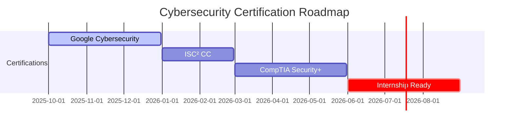

<!-- Kali Linux Terminal Banner -->
<p align="center">
  
</p>

<!-- ASCII Separator -->
<p align="center">
  
</p>

<!-- Hacker Typing Animation -->
<p align="center">
  
</p>

<!-- Project Badges -->
<p align="center">
  
  
  
  
</p>

---

## whoami — System Info

```bash
╭─root@kali-aarav ~
╰─$ cat /etc/profile

USER: aarav
ROLE: cybersecurity_student
STATUS: active_learning
FOCUS: [ "CVE_research", "linux_security", "secure_development" ]
CERTIFICATIONS: {
  "Google Cybersecurity": "75% complete",
  "ISC² CC": "planned_jan_2026",
  "Security+": "planned_may_2026"
}
LAB_ENVIRONMENT: [ "Kali_Linux", "VirtualBox", "DVWA", "TryHackMe" ]
WEEKLY_COMMITMENT: "5_hours_during_school"
TARGET_ROLE: "security_internship_2026"

╰─$ exit
```

---

## Featured Projects

<table>
<tr>
<td width="50%">

### VulnForge — CVE Reproduction Lab

Structured environment for analyzing real-world vulnerabilities. Reproducing SQL Injection, XSS, and authentication bypasses with CVSS scoring and detailed mitigations.

**Stack:** Python automation, Kali Linux, DVWA, Bash  
**Focus:** Vulnerability analysis, ethical hacking, technical documentation

[View Repository →](#)

</td>
<td width="50%">

### SecureScholar — Education Platform

Interactive web application teaching cybersecurity fundamentals. Password security, phishing awareness, and digital hygiene modules with React frontend.

**Stack:** React, JavaScript, NIST guidelines  
**Focus:** Web security, secure coding practices, educational design

[View Repository →](#)

</td>
</tr>

<tr>
<td width="50%">

### Cybersecurity Portfolio Hub

Complete documentation of certification journey. Every lab, command, and lesson learned organized for recruiters. Linux permissions, SQL queries, network analysis.

**Stack:** Markdown, Git, structured documentation  
**Focus:** Technical writing, project management, evidence-based learning

[View Repository →](#)

</td>
<td width="50%">


</td>
</tr>
</table>

---

## Technical Arsenal

```bash
╭─root@kali-aarav ~/skills
╰─$ tree -L 2

.
├── operating_systems/
│   ├── linux_administration (Ubuntu, Kali, Debian)
│   ├── bash_scripting_automation
│   ├── file_permissions_management
│   └── virtualization (VirtualBox, isolated_labs)
│
├── security_tools/
│   ├── vulnerability_research (CVE_analysis, CVSS_scoring)
│   ├── sql_injection (testing, mitigation, prevention)
│   ├── network_analysis (tcpdump, Wireshark, packet_inspection)
│   └── log_analysis (security_incidents, threat_detection)
│
└── development/
    ├── python (automation, security_scripts, data_processing)
    ├── sql (queries, injection_prevention, secure_db_design)
    ├── react (web_security_apps, frontend_development)
    └── version_control (Git, GitHub, portfolio_management)
```

<p align="center">
  
</p>

<p align="center">
  
</p>

---

## Certification Timeline

<div align="center">



| Certification | Progress | Target Date | Evidence |
|--------------|----------|-------------|----------|
| **Google Cybersecurity Professional** |  | Dec 2025 | [Portfolio Hub](#) |
| **ISC² Certified in Cybersecurity** |  | Feb 2026 | Prep in progress |
| **CompTIA Security+** |  | May 2026 | VulnForge labs |

</div>

---

## Learning Approach

**Evidence-Based Portfolio Development**  
Every skill claim backed by documented labs, screenshots, and detailed command outputs. Professional presentation following industry standards.

**Structured Weekly Sprints**  
5-hour weekly commitment with clear deliverables: course modules, hands-on labs, project contributions, and reflective documentation.

**Practical Over Theory**  
Focus on real vulnerabilities, actual commands, working exploits in controlled environments. Learning by doing, not just reading.

---

## Connect

<p align="center">
  <a href="https://github.com/AaravArora3835">
    
  </a>
  <a href="mailto:aaravarora3835@gmail.com">
    
  </a>
  
</p>

<div align="center">

**Seeking:** Security mentorship · Student collaboration · Internship opportunities (Aug 2026)

</div>

---

## GitHub Analytics

<p align="center">
  
  
</p>

<p align="center">
  
</p>

---

<p align="center">
  
</p>

<p align="center">
  <code>$ echo "Building security skills one commit at a time"</code>
</p>

<p align="center">
  <sub>Last updated: December 2025 | Portfolio actively maintained</sub>
</p>
